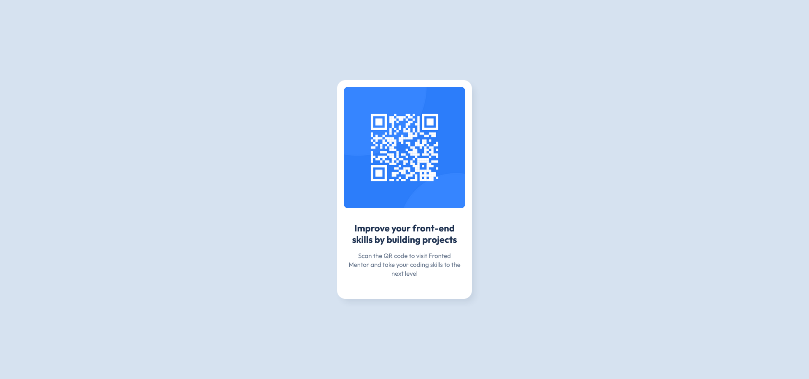

# Frontend Mentor - QR code component solution

This is a solution to the [QR code component challenge on Frontend Mentor](https://www.frontendmentor.io/challenges/qr-code-component-iux_sIO_H). Frontend Mentor challenges help you improve your coding skills by building realistic projects. 

## Table of contents

- [Frontend Mentor - QR code component solution](#frontend-mentor---qr-code-component-solution)
  - [Table of contents](#table-of-contents)
  - [Overview](#overview)
    - [Screenshot](#screenshot)
    - [Links](#links)
  - [My process](#my-process)
    - [Built with](#built-with)
    - [What I learned](#what-i-learned)
    - [Continued development](#continued-development)
    - [Useful resources](#useful-resources)
  - [Author](#author)


## Overview

### Screenshot



### Links

- Solution URL: [Fronted Mentor Solution](https://www.frontendmentor.io/solutions/qr-code-component-html-and-css-CPCsP1rYmE)
- Live Site URL: [Live Site](https://irie-yamashita.github.io/qr-code-component/)

## My process

### Built with

- Semantic HTML5 markup
- CSS custom properties
- Flexbox


### What I learned

I learned how to work with CSS custom properties (variables) to make my styles more reusable and maintainable. I also started using the HSL color model instead of RGB or HEX values.

```css
:root {
  --slate-300: hsl(212, 45%, 89%);
  --slate-500: hsl(216, 15%, 48%);
  --slate-900: hsl(218, 44%, 22%);
}

.qr-title {
  color: var(--slate-900);
}
```


### Continued development

I want to focus on responsive layouts and get more familiar with CSS and Tailwind CSS.


### Useful resources

- [MDN-Using CSS custom properties (variables)](https://developer.mozilla.org/en-US/docs/Web/CSS/CSS_cascading_variables/Using_CSS_custom_properties)
- [Box Shadow Generator](https://cssgenerator.pl/en/box-shadow-generator/)

## Author

- Website - [Add your name here](https://www.your-site.com)
- Frontend Mentor - [@irie-yamashita](https://www.frontendmentor.io/profile/irie-yamashita)
